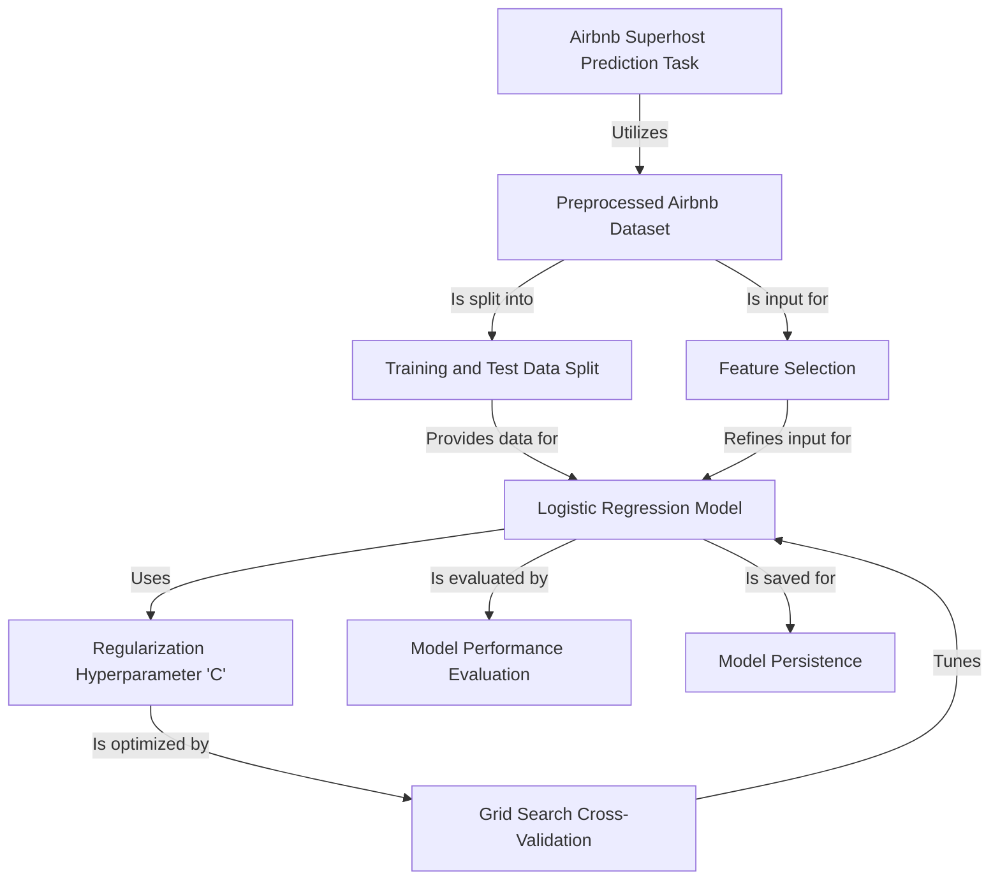
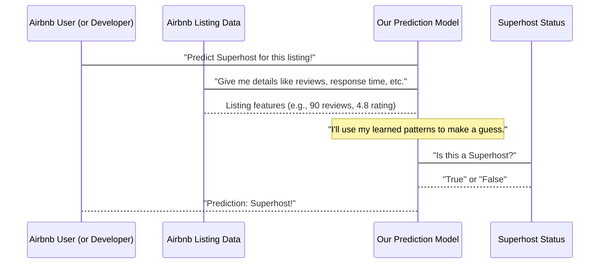
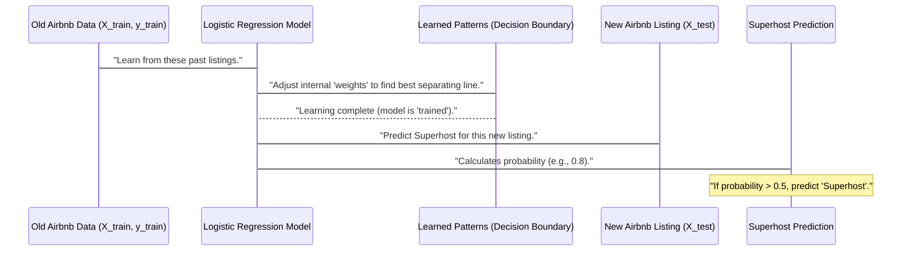
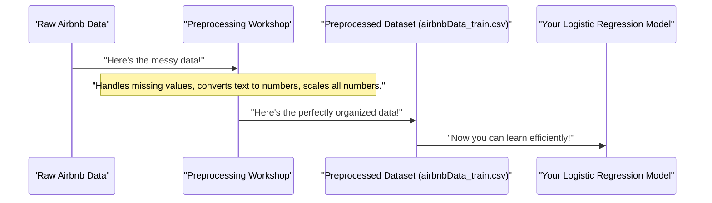
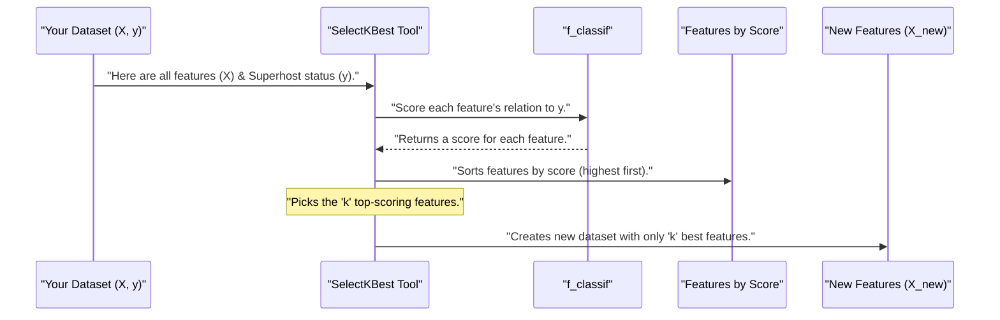
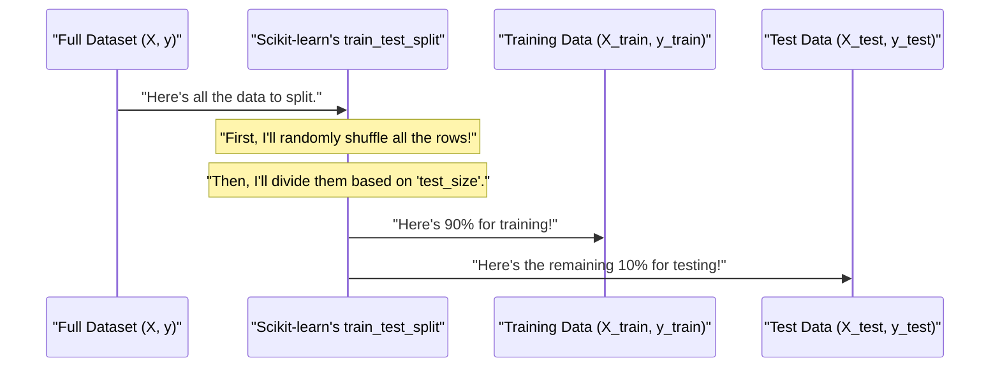
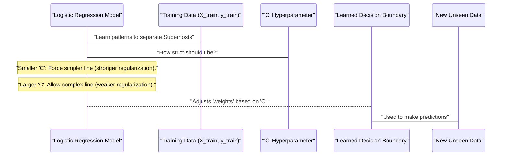
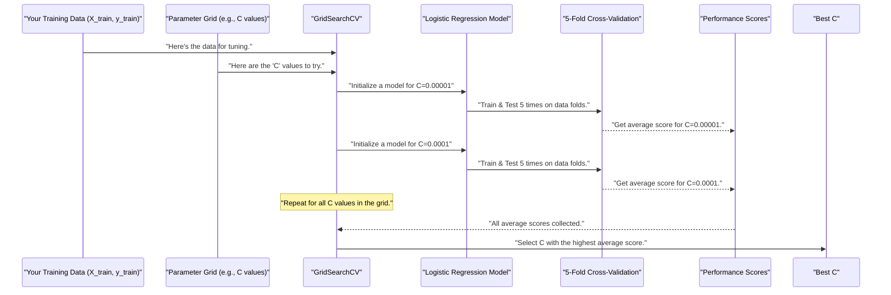
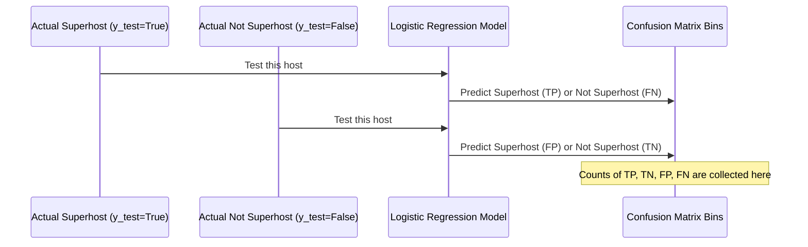
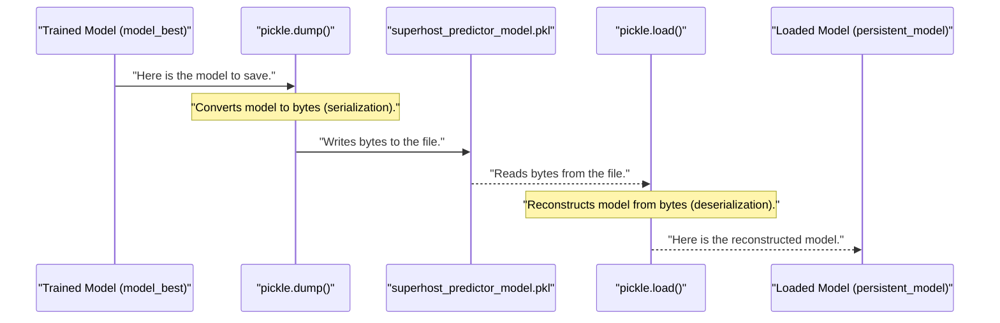

# Tutorial: logistic-regression-model-to-predict-airbnb-superhost

This project **builds a machine learning model** to *predict* whether an Airbnb host will achieve 'Superhost' status. It uses a **Logistic Regression model** to learn from preprocessed Airbnb data, then *optimizes* its settings and evaluates its performance to make accurate predictions. Finally, the trained model is *saved* for future use.


## Visual Overview



## Chapters

1. [Airbnb Superhost Prediction Task
](01_airbnb_superhost_prediction_task_.md)
2. [Logistic Regression Model
](02_logistic_regression_model_.md)
3. [Preprocessed Airbnb Dataset
](03_preprocessed_airbnb_dataset_.md)
4. [Feature Selection
](04_feature_selection_.md)
5. [Training and Test Data Split
](05_training_and_test_data_split_.md)
6. [Regularization Hyperparameter 'C'
](06_regularization_hyperparameter__c__.md)
7. [Grid Search Cross-Validation
](07_grid_search_cross_validation_.md)
8. [Model Performance Evaluation
](08_model_performance_evaluation_.md)
9. [Model Persistence
](09_model_persistence_.md)


# Chapter 1: Airbnb Superhost Prediction Task

Welcome, aspiring data scientist! In this tutorial, we're going to embark on an exciting journey to understand how computers can learn to make smart guesses, specifically about Airbnb hosts.

Imagine you're an Airbnb host, and you want to achieve "Superhost" status. This is a special badge from Airbnb that shows guests you're an experienced and highly-rated host. It can lead to more bookings and trust! But what exactly makes someone a Superhost? Is it how many reviews they have? How quickly they respond to messages? Or maybe the price of their listing?

This is exactly the kind of question we'll explore with our project: building a **smart system that can look at an Airbnb listing and predict whether the host is a "Superhost" or not.**

### What is a Superhost Prediction Task?

At its heart, predicting an Airbnb Superhost is a problem that can be solved using **Machine Learning**. Think of Machine Learning as teaching a computer to recognize patterns and make decisions, much like how you learn from experience.

Here are the key ideas behind this task:

*   **Superhost Status**: Airbnb defines specific criteria for a Superhost, like having a high rating, low cancellation rate, and quick response time. For our project, we will use a dataset where each host is already labeled as either a "Superhost" (True) or "Not a Superhost" (False). This is the "answer" we want our model to predict.

*   **Prediction Task**: When we say "prediction," we don't mean looking into the future! Instead, it means using existing information (like details about an Airbnb listing) to guess the most likely Superhost status. It's like a doctor predicting if you have the flu based on your symptoms today.

*   **Binary Classification**: Since our model needs to predict one of two outcomes (Superhost or Not Superhost), this type of prediction task is called **binary classification**. "Binary" means two, and "classification" means putting things into categories.

### Why is this useful?

*   **For Hosts**: Imagine having a tool that could tell you, "Based on your listing's features, you're very likely to become a Superhost!" or "You might need to improve your response time to get that badge." This kind of insight can help hosts improve.
*   **For Airbnb**: Airbnb could use this to identify potential Superhosts early on and offer them support, or to understand what drives Superhost success.
*   **For Guests**: While not directly used by guests, a higher number of Superhosts often means a better overall experience on the platform.

### How Does Our System "Predict"?

Our prediction system works by first looking at a lot of past Airbnb listings. It learns what patterns in the listing details (like the number of reviews, average rating, etc.) usually lead to a host being a Superhost. Once it learns these patterns, we can give it a *new* listing's details, and it will use what it learned to make a prediction.

Let's imagine the basic flow:



In this diagram, the `Prediction Model` is the "smart system" we're building. It takes information (called **features**) about an Airbnb listing and predicts the **label** (whether the host is a Superhost).

### Identifying Features and Labels in Our Data

To teach our model, we need data! Our project uses a preprocessed Airbnb dataset. "Preprocessed" simply means the data has already been cleaned and prepared so it's ready for our model to learn from.

In any machine learning task, we need to clearly define two things:

1.  **Label (What we want to predict)**: This is the answer we're trying to find. In our case, it's whether a host is a Superhost. Our dataset has a column specifically for this, called `host_is_superhost`. It will contain `True` or `False` values.

2.  **Features (What we use to predict)**: These are all the pieces of information in our dataset that we believe might help us make the prediction. For example, things like:
    *   `number_of_reviews`
    *   `review_scores_rating`
    *   `host_response_time`
    *   And many other details about the listing and host.

Let's look at how we prepare our data to separate these `features` from the `label` using Python and a powerful tool called `pandas`.

First, we need to load our data into something called a DataFrame. A DataFrame is like a smart spreadsheet that Python can understand and work with.

```python
import pandas as pd
import os

# Define the file path. 'os.getcwd()' gets our current location.
filename = os.path.join(os.getcwd(), "data_LR", "airbnbData_train.csv")

# Load the data into a DataFrame called 'df'
df = pd.read_csv(filename, header=0)

# The 'df' now holds all our Airbnb listing information.
print("Data loaded successfully!")
print(f"Number of rows: {len(df)}")
```
This small piece of code loads our Airbnb data from a file named `airbnbData_train.csv` into a `pandas` DataFrame. Imagine this DataFrame as a big table containing all the listing details and their Superhost status.

Next, we split this big table into two parts: one for the `label` (what we want to predict) and one for the `features` (what we use to predict).

```python
# 'y' will be our Label: the 'host_is_superhost' column
# This column tells us if a host is a Superhost (True) or not (False).
y = df["host_is_superhost"]

# 'X' will be our Features: all other columns in the DataFrame
# We 'drop' the 'host_is_superhost' column from 'df' to create 'X'.
X = df.drop(columns = "host_is_superhost", axis = 1)

print("\nLabel (y) and Features (X) separated!")
print(f"Number of features (columns in X): {X.shape[1]}")
print(f"First 5 labels (y): {y.head()}")
```

After running this code, `y` holds only the Superhost status for each listing, and `X` holds all the other information (our features). This `X` and `y` setup is standard practice in machine learning and is how we'll feed our data to the prediction model.

### Conclusion

In this chapter, we've introduced the core problem our project aims to solve: predicting whether an Airbnb host is a "Superhost." We learned that this is a **binary classification task**, meaning we're predicting one of two outcomes. We also saw how to identify the **label** (what we predict) and **features** (what we use to predict) within our dataset, preparing it for machine learning.

Now that we understand the task and how to set up our data, we're ready to dive into the engine that makes these predictions possible: the Logistic Regression Model.

[Chapter 2: Logistic Regression Model](02_logistic_regression_model_.md)

---

<sub><sup>Generated by [AI Codebase Knowledge Builder](https://github.com/The-Pocket/Tutorial-Codebase-Knowledge).</sup></sub> <sub><sup>**References**: [[1]](https://github.com/ishmumzaman/logistic-regression-model-to-predict-airbnb-superhost/blob/757cb7b234f2541bdf21b06501286615551846dd/ModelSelectionForLogisticRegression.ipynb)</sup></sub>


# Chapter 2: Logistic Regression Model

Welcome back, aspiring data scientist! In [Chapter 1: Airbnb Superhost Prediction Task](01_airbnb_superhost_prediction_task_.md), we learned that our goal is to build a smart system that can predict whether an Airbnb host is a "Superhost" or "Not a Superhost." We also saw how to prepare our data by separating it into **features** (the information we use to predict) and the **label** (what we want to predict: `host_is_superhost`).

Now, the big question is: How does the computer actually *learn* to make these predictions? What kind of "smart system" are we building?

This is where the **Logistic Regression Model** comes in! It's a fundamental machine learning algorithm specifically chosen for our Superhost prediction task. Imagine it as a special kind of decision-maker that learns how to draw a clear line between "Superhost" and "Not Superhost" examples based on the available data.

### What is a Logistic Regression Model?

At its heart, Logistic Regression is a **statistical model** used for **binary classification**. Remember, "binary classification" means predicting one of two possible outcomes (like `True` or `False` for Superhost status).

Here's a simple way to think about it:

*   **Not a "Yes/No" Machine (Directly):** Unlike some simple rules you might write (e.g., "if reviews > 100, then Superhost"), Logistic Regression doesn't immediately say "yes, Superhost" or "no, Not Superhost."
*   **A "Probability" Predictor:** Instead, it calculates the *probability* (a number between 0 and 1) that an event will occur. For our project, it predicts the probability that a given Airbnb host *is* a Superhost.
    *   Think of it like a weather forecast: it doesn't just say "rain" or "no rain." It says, "there's an 80% chance of rain" or "a 10% chance of rain."
*   **The "Decision Boundary":** The model learns by looking at all our `features` (like `number_of_reviews`, `review_scores_rating`, `host_response_time`, etc.) and figuring out the best way to separate the "Superhost" examples from the "Not Superhost" examples.
    *   Imagine you have a big scatter plot where each dot is an Airbnb listing. Some dots are blue (Superhost), and some are red (Not Superhost). Logistic Regression tries to find the best "line" (or a more complex "boundary" if there are many features) that separates the blue dots from the red dots. This "line" is called the **decision boundary**.

### How Does it Work for Superhosts?

1.  **Input Features**: You give the Logistic Regression model all the `features` (like review counts, response times) from an Airbnb listing (our `X` data from the previous chapter).
2.  **Calculate Probability**: The model uses its learned "rules" (the decision boundary) to calculate a probability score. This score tells us how likely it thinks the host is a Superhost.
    *   A score close to 1 means a very high probability of being a Superhost.
    *   A score close to 0 means a very low probability.
3.  **Make a Classification**: Once it has the probability, the model applies a **threshold**. By default, this threshold is usually 0.5 (or 50%).
    *   If the calculated probability is **greater than 0.5**, the model predicts "Superhost" (`True`).
    *   If the calculated probability is **less than or equal to 0.5**, the model predicts "Not a Superhost" (`False`).

So, the Logistic Regression Model is our core "smart system" that learns from past data to calculate a Superhost probability and then makes a final Superhost/Not Superhost prediction.

### Learning and Predicting with Logistic Regression (Under the Hood)

Let's quickly visualize the general process of how our Logistic Regression model will "learn" and then "predict."



In the real world, this "learning" process is often called **training** the model, and making guesses on new data is called **predicting** or **inference**.

### Using Logistic Regression in Python

We'll use a powerful Python library called `scikit-learn` to build our Logistic Regression model. It makes machine learning very straightforward!

First, we need to import the `LogisticRegression` class from `scikit-learn`.

```python
from sklearn.linear_model import LogisticRegression
import pandas as pd
import os

# Assume X_train and y_train are loaded from Chapter 1's setup
# For demonstration, let's quickly load them again:
filename = os.path.join(os.getcwd(), "data_LR", "airbnbData_train.csv")
df = pd.read_csv(filename, header=0)
y_train = df["host_is_superhost"]
X_train = df.drop(columns="host_is_superhost", axis=1)

# We'll also need X_test and y_test later (from Chapter 5)
# For now, let's just use X_train for prediction for simplicity.
X_test = X_train # Just for this example; usually separate test data

print("Imported LogisticRegression and loaded data.")
```
This code simply loads our `X_train` and `y_train` data again. `X_train` contains all the features for our historical Airbnb listings, and `y_train` contains their actual Superhost status.

Next, we create an "empty" Logistic Regression model and tell it to `fit` (or "learn") from our training data.

```python
# Create a Logistic Regression model object
# max_iter=1000 means the model will try up to 1000 times to learn the best "line."
model = LogisticRegression(max_iter=1000)

# "Fit" the model to our training data (X_train and y_train).
# This is where the model learns the patterns!
model.fit(X_train, y_train)

print("Logistic Regression model created and trained!")
# The output will show the model's settings (like max_iter=1000)
```
The `model.fit(X_train, y_train)` line is where the magic happens! The Logistic Regression algorithm looks at all the `X_train` features and `y_train` labels, and figures out how each feature contributes to a host being a Superhost. It adjusts its internal "weights" for each feature to draw the best possible decision boundary.

Once the model is `fit` (or "trained"), we can use it to make predictions on new, unseen data, like our `X_test` data (which we'll officially split in [Chapter 5: Training and Test Data Split](05_training_and_test_data_split_.md)).

We can ask the model for two types of predictions:

1.  **Probabilities**: The chance (between 0 and 1) that a host is a Superhost.
2.  **Class Labels**: The final "Superhost" or "Not Superhost" decision.

```python
# 1. Predict the probability of being a Superhost for each listing in X_test.
# model.predict_proba() returns probabilities for both "False" and "True" classes.
# We want the probability for the "True" class (Superhost), which is the second column (index 1).
proba_predictions = model.predict_proba(X_test)[:, 1]

# 2. Predict the actual class label ("True" or "False") for each listing in X_test.
# This uses a default threshold (usually 0.5) on the probabilities.
class_label_predictions = model.predict(X_test)

print("\nModel has made predictions!")
print(f"First 5 probability predictions: {proba_predictions[:5]}")
print(f"First 5 class label predictions: {class_label_predictions[:5]}")
```
As you can see, `proba_predictions` gives us numbers like `0.23` or `0.87`, telling us the model's confidence. `class_label_predictions` then converts these probabilities into the final `True` or `False` Superhost labels, based on the 0.5 threshold.

### Conclusion

In this chapter, we've explored the core of our Superhost prediction system: the **Logistic Regression Model**. We learned that it's a powerful tool for **binary classification**, predicting the *probability* of an event and then using a **threshold** to make a final "yes" or "no" decision. We also saw how `scikit-learn` simplifies the process of **training** and **predicting** with this model.

Now that we understand the prediction engine, the next step is to prepare our Airbnb data even further so it's perfectly clean and ready for deep analysis and modeling.

[Chapter 3: Preprocessed Airbnb Dataset](03_preprocessed_airbnb_dataset_.md)

---

<sub><sup>Generated by [AI Codebase Knowledge Builder](https://github.com/The-Pocket/Tutorial-Codebase-Knowledge).</sup></sub> <sub><sup>**References**: [[1]](https://github.com/ishmumzaman/logistic-regression-model-to-predict-airbnb-superhost/blob/757cb7b234f2541bdf21b06501286615551846dd/ModelSelectionForLogisticRegression.ipynb)</sup></sub>


# Chapter 3: Preprocessed Airbnb Dataset

Welcome back, future data scientist! In [Chapter 1: Airbnb Superhost Prediction Task](01_airbnb_superhost_prediction_task_.md), we introduced our exciting goal: teaching a computer to predict if an Airbnb host is a "Superhost." Then, in [Chapter 2: Logistic Regression Model](02_logistic_regression_model_.md), you learned about the "brain" of our system, the Logistic Regression Model, which learns patterns to make these predictions.

Now, imagine you're cooking a delicious meal. You wouldn't just throw raw, unwashed vegetables straight into the pot, right? You'd clean them, chop them, and prepare them so they cook perfectly and taste great.

It's the same with data for a machine learning model! Raw data from the real world is often messy, incomplete, and not in the right format for a computer to understand. If you feed messy data into our Logistic Regression model, it simply won't learn well, or it might even break!

This is where the "Preprocessed Airbnb Dataset" comes in.

### What is a "Preprocessed Airbnb Dataset"?

For our project, "Preprocessed Airbnb Dataset" refers to a special file named `airbnbData_train.csv`. Think of this file as your perfectly prepared ingredients for the machine learning model!

**The Big Problem Solved:** Raw data is full of issues like:
*   **Missing Information:** Some listings might not have a `number_of_reviews`. What should the computer do then?
*   **Text Descriptions:** How do you tell a computer that "fast response time" is good, when it only understands numbers?
*   **Mixed Scales:** `number_of_reviews` might be a few hundreds, while `price` might be in tens or hundreds. These different "scales" can confuse the model.

**The Solution:** Our `airbnbData_train.csv` file is a dataset where all these messy issues have already been taken care of. It's been **cleaned** and **prepared** specifically so our machine learning model can use it directly without any further fuss.

It's like getting a perfectly organized and polished dataset, ready for analysis and model training!

### Raw Data vs. Preprocessed Data

Let's look at a simple comparison:

| Feature/Problem           | Raw Data Example             | Preprocessed Data Example (`airbnbData_train.csv`) |
| :------------------------ | :--------------------------- | :------------------------------------------------ |
| `number_of_reviews`       | `150`                        | `0.75` (Scaled, so all numbers are similar)      |
| `host_response_time`      | `"within an hour"`           | `0` (Encoded as a number)                        |
| `host_is_superhost`       | `"t"` or `"f"` (True/False) | `1` or `0` (Encoded as numbers)                  |
| Missing Values (`price`)  | `NaN` (Not a Number)         | `85.50` (Missing value filled in with a smart guess) |

Notice how messy text like `"within an hour"` or `"t"` becomes a neat number, and `150` becomes `0.75` (a scaled number). This transformation, along with filling in missing values, is what "preprocessing" achieves.

### How it Helps Our Superhost Prediction Task

For our Superhost prediction, `airbnbData_train.csv` contains two main types of information:

1.  **Features (Inputs)**: These are all the details about an Airbnb listing that help us predict Superhost status. Examples from this file include:
    *   `number_of_reviews`
    *   `review_scores_rating`
    *   `host_response_time_within_a_day`
    *   And many other numerical pieces of information.
2.  **Target Variable (The Answer)**: This is the `host_is_superhost` column, which tells us whether a host actually *is* a Superhost (`1`) or *not* (`0`). This is the "answer" our model will learn to predict.

### Using the Preprocessed Dataset in Python

Just like we saw in Chapter 1 and 2, working with this preprocessed data in Python is straightforward using the `pandas` library.

First, we load the `airbnbData_train.csv` file into a `DataFrame` (which is like a smart spreadsheet):

```python
import pandas as pd
import os

# Define the file path. 'os.getcwd()' gets our current location.
filename = os.path.join(os.getcwd(), "data_LR", "airbnbData_train.csv")

# Load the data into a DataFrame called 'df'
df = pd.read_csv(filename, header=0)

print("Preprocessed Airbnb data loaded successfully!")
print(f"Number of rows: {len(df)}")
# You can see the first few rows of your clean data!
print("\nFirst 5 rows of the dataset:")
print(df.head())
```

<small>Output from `df.head()` will show a table with many columns of numbers and `host_is_superhost` as 0 or 1.</small>

Next, we separate our "features" (what we use to predict) from our "target" (what we want to predict).

```python
# 'y' will be our Target Variable: the 'host_is_superhost' column
# This column tells us if a host is a Superhost (1) or not (0).
y = df["host_is_superhost"]

# 'X' will be our Features: all other columns in the DataFrame
# We 'drop' (remove) the 'host_is_superhost' column from 'df' to create 'X'.
X = df.drop(columns = "host_is_superhost", axis = 1)

print("\nTarget (y) and Features (X) separated!")
print(f"Number of features (columns in X): {X.shape[1]}") # X.shape[1] tells us the number of columns
print(f"First 5 target values (y): {y.head()}")
```

This code snippet gives us `X` (our clean, numerical features) and `y` (our clean, numerical target). These `X` and `y` are perfectly ready for our Logistic Regression Model to learn from! The best part is, you don't need to write any complex cleaning code yourself in this project because it's already done.

### What Happens "Under the Hood" (The Preprocessing Magic)

You might be wondering: if `airbnbData_train.csv` is already preprocessed, what *actually* happened to the raw data before we received it?

Think of it as a hidden workshop where all the data preparation magic happens:



In this diagram, the "Preprocessing Workshop" represents all the complicated steps (like filling in missing values, converting text categories into numbers, and making sure all numbers are on a similar scale) that were performed on the raw Airbnb data *before* you even started this tutorial.

For example, the `ModelSelectionForLogisticRegression.ipynb` notebook (which this tutorial is based on) directly loads `airbnbData_train.csv` and then uses it immediately for machine learning tasks like splitting into training/test sets and training the model. There are no additional data cleaning steps because they were already completed in this "Preprocessing Workshop."

```python
# From ModelSelectionForLogisticRegression.ipynb
# This is an example from the actual project notebook.
# Notice how the data is loaded and then immediately split into X and y
# without any intermediate cleaning steps.

filename = os.path.join(os.getcwd(), "data_LR", "airbnbData_train.csv")
df = pd.read_csv(filename, header=0)

# The label (what we predict)
y = df["host_is_superhost"]
# The features (what we use to predict)
X = df.drop(columns = "host_is_superhost", axis = 1)

# X and y are now ready for the machine learning model!
```

This setup ensures that our Logistic Regression model (from Chapter 2) receives only high-quality, numeric data, allowing it to focus on its main job: learning the patterns to predict Superhost status accurately.

### Conclusion

In this chapter, we've understood the importance of **preprocessed data** in machine learning. We learned that the `airbnbData_train.csv` file provides us with a **clean, prepared, and numeric dataset**, saving us from complex data cleaning steps. This perfectly organized data, with its **features (X)** and **target (y)**, is the essential fuel for our Logistic Regression model.

Now that our data is perfectly ready, the next step is to decide which specific pieces of information (features) are most important for our model to make the best predictions. This is called "Feature Selection."

[Chapter 4: Feature Selection](04_feature_selection_.md)

---

<sub><sup>Generated by [AI Codebase Knowledge Builder](https://github.com/The-Pocket/Tutorial-Codebase-Knowledge).</sup></sub> <sub><sup>**References**: [[1]](https://github.com/ishmumzaman/logistic-regression-model-to-predict-airbnb-superhost/blob/757cb7b234f2541bdf21b06501286615551846dd/ModelSelectionForLogisticRegression.ipynb)</sup></sub>


# Chapter 4: Feature Selection

Welcome back, aspiring data scientist! In [Chapter 3: Preprocessed Airbnb Dataset](03_preprocessed_airbnb_dataset_.md), we got our hands on a perfectly cleaned and organized dataset, ready to be fed into our machine learning model. We have our `X` (features – all the listing details) and `y` (the target – whether a host is a Superhost).

Now, imagine you're a chef preparing a signature dish. You have a pantry full of many ingredients: fresh vegetables, exotic spices, different types of meat, and perhaps even some obscure items. To make your dish truly delicious, you wouldn't just throw *everything* into the pot, right? You'd carefully pick the most important, flavorful ingredients that truly define your dish and make it stand out.

It's the same with our Airbnb Superhost prediction model! Our `X` dataset contains many "features" or pieces of information about each Airbnb listing. While our data is clean, not all these features are equally important for predicting whether a host is a Superhost.

**The Problem:** Having too many features can sometimes:
*   **Confuse the Model:** Some features might be irrelevant or even misleading, like adding a spice that doesn't belong in your dish.
*   **Slow Down Training:** More features mean more data for the model to process, making it slower to learn.
*   **Reduce Accuracy:** Irrelevant features can sometimes add "noise" that makes the model perform worse.

**The Solution:** This is where **"Feature Selection"** comes in! It's like being that skilled chef, carefully selecting only the *most relevant* ingredients that contribute most to the final delicious outcome.

### What is Feature Selection?

Feature selection is a powerful technique used in machine learning to **identify and pick the most relevant input variables (features)** from your dataset. The goal is to choose a smaller, more impactful set of features that truly help in predicting the `y` (our Superhost status).

Think of it as a skilled editor cutting out unnecessary words from a document to make the core message clearer and more impactful. We want our model to focus on what truly matters.

In our project, we'll use a specific method called **`SelectKBest`** from the `scikit-learn` library.

### How Does `SelectKBest` Pick the "Best" Features?

`SelectKBest` works by looking at each feature individually and giving it a "score" based on how strongly it relates to our target variable (`host_is_superhost`). It then selects the 'K' features with the highest scores.

*   **'K'**: This is a number you decide. It tells `SelectKBest` how many top features you want to keep. If you set `k=5`, it will pick the top 5 features.
*   **Scoring Function (like `f_classif`)**: To assign these scores, `SelectKBest` needs a way to measure the relationship. For classification tasks like ours (Superhost or Not Superhost), a common scoring method is `f_classif`. You don't need to understand the complex math behind it right now, just know that `f_classif` helps identify features that are good at separating the "Superhost" examples from the "Not Superhost" examples. It's like having a special sensor that tells you how much each ingredient contributes to the "Superhost flavor" of your dish!

By using `SelectKBest` with `f_classif`, we let the computer help us find the most influential features.

### Using `SelectKBest` in Python

Let's see how we can apply this to our Airbnb dataset. First, we need to load our preprocessed data and split `X` and `y`, just like we did in previous chapters.

```python
import pandas as pd
import os

# Assume 'X' and 'y' are already loaded and separated from Chapter 3.
# For demonstration, let's quickly load them again:
filename = os.path.join(os.getcwd(), "data_LR", "airbnbData_train.csv")
df = pd.read_csv(filename, header=0)
y = df["host_is_superhost"]
X = df.drop(columns="host_is_superhost", axis=1)

print("Data loaded and X, y separated for feature selection.")
```
This code makes sure our `X` (all features) and `y` (Superhost status) are ready.

Now, we'll use `SelectKBest` to find the top features. We'll start by picking a small number (like 2) just to see how it works. In a real project, you might experiment with different values of 'K'.

```python
from sklearn.feature_selection import SelectKBest
from sklearn.feature_selection import f_classif # Our scoring function

# 1. Create a SelectKBest object.
#    We want the 'k' best features, and we'll use 'f_classif' to score them.
selector = SelectKBest(f_classif, k=2) # Let's pick the top 2 features for now

# 2. "Fit" the selector to our full dataset (X and y).
#    This is where SelectKBest calculates scores for all features.
selector.fit(X, y)

# 3. Get a "mask" that tells us which features were selected (True/False).
filter_mask = selector.get_support()

# 4. Use the mask to get the names of the top features.
top_2_features = X.columns[filter_mask]

print("\nBest 2 features selected:")
print(top_2_features)
```
When you run this code, `top_2_features` will show you the names of the two features that `SelectKBest` found to be most related to Superhost status. In the actual project notebook (`ModelSelectionForLogisticRegression.ipynb`), you'll see it identifies `number_of_reviews` and `number_of_reviews_ltm` (number of reviews in the last 12 months) as very important. This makes sense, as a host with many good reviews is more likely to be a Superhost!

After selecting the features, we'll create new `X` (features) datasets containing *only* these important features. This is what our Logistic Regression model will use from now on.

```python
# Create new training and test data for features, using only the selected top features
# X_train and X_test will be officially split in Chapter 5.
# For this example, imagine we are preparing for the split.
new_X = X[top_2_features]

print(f"\nNew X (features) has {new_X.shape[1]} columns (features).")
print("First 5 rows of new X (only selected features):")
print(new_X.head())
```
Now, `new_X` contains only the most important features, making our dataset leaner and potentially more effective for the model.

### What Happens "Under the Hood" of `SelectKBest`?

Let's visualize the process `SelectKBest` goes through:



In the actual project notebook (`ModelSelectionForLogisticRegression.ipynb`), the `SelectKBest` step happens *before* the final model training. It's used to create a simplified version of `X_train` and `X_test` for the model to work with.

```python
# From ModelSelectionForLogisticRegression.ipynb (relevant snippet for context)

# ... (Assume X and y are loaded) ...

from sklearn.feature_selection import SelectKBest
from sklearn.feature_selection import f_classif

# Select the top 2 features (or any 'k' you want to try)
selector = SelectKBest(f_classif, k=2)
selector.fit(X, y)
filter = selector.get_support()
top_features = X.columns[filter]

# Now, when we split data (in the next chapter), we'd use these top features:
# For example, if X_train and X_test were already split, you'd do:
# new_X_train = X_train[top_features]
# new_X_test = X_test[top_features]
# The rest of the notebook then uses 'X_train' and 'y_train' (or the 'new_X_train')
# to fit the model.
```

This ensures that our Logistic Regression model learns from the most valuable information, ignoring any less relevant data that might otherwise complicate the learning process.

### Conclusion

In this chapter, we've learned about **Feature Selection**, a crucial step in preparing our data for machine learning. We understood why it's important (to simplify the model, speed up training, and improve accuracy) and how a tool like `SelectKBest` with `f_classif` helps us identify and choose the most impactful features for our Airbnb Superhost prediction task.

Now that we know how to select the best features, the next critical step is to carefully divide our prepared data into "training" and "test" sets. This separation is essential for fairly evaluating how well our model learns and predicts.

[Chapter 5: Training and Test Data Split](05_training_and_test_data_split_.md)

---

<sub><sup>Generated by [AI Codebase Knowledge Builder](https://github.com/The-Pocket/Tutorial-Codebase-Knowledge).</sup></sub> <sub><sup>**References**: [[1]](https://github.com/ishmumzaman/logistic-regression-model-to-predict-airbnb-superhost/blob/757cb7b234f2541bdf21b06501286615551846dd/ModelSelectionForLogisticRegression.ipynb)</sup></sub>


# Chapter 5: Training and Test Data Split

Welcome back, future data scientist! In [Chapter 4: Feature Selection](04_feature_selection_.md), we discussed how to pick the most important ingredients (features) for our Airbnb Superhost prediction model. We have our clean, preprocessed data, with its `X` (features) and `y` (Superhost status), ready to be learned from.

Now, imagine you're a student preparing for a big exam. You have a textbook with hundreds of practice questions. To truly know if you've *learned* the material (and not just memorized the answers to the practice questions), you wouldn't use *all* the practice questions for your final test, right? You'd study with some questions, and then your teacher would give you a completely *new* set of questions for the actual exam.

This is exactly what we need to do with our machine learning model! If we train our model using *all* our data, and then test it on the *same* data, it might look like it's performing perfectly. But in reality, it could just be "memorizing" the data it saw, rather than truly "learning" the underlying patterns. This is like a student memorizing exam answers without understanding the concepts. When faced with new questions, they would fail.

**The Problem:** How do we fairly evaluate our Superhost prediction model to ensure it can make good predictions on *new, unseen Airbnb listings* in the future?

**The Solution:** We **split our data** into two distinct parts: a "training set" and a "test set."

### What is Training and Test Data Split?

This is a fundamental step in machine learning to properly evaluate a model.

1.  **Training Data:** This is the largest portion of your dataset (e.g., 80% or 90%). It's the data the machine learning model will **learn from**. Our Logistic Regression model will use the `X_train` features and `y_train` labels to find patterns and build its prediction rules. Think of it as the "practice questions" for the model.

2.  **Test Data:** This is a smaller, completely separate portion of your dataset (e.g., 10% or 20%). This data is kept **hidden** from the model during the training phase. After the model has learned from the training data, we use the `X_test` features to ask it to make predictions, and then we compare these predictions to the actual `y_test` labels. This reveals how well the model **generalizes** to new, unseen information. Think of it as the "actual exam questions" for the model.

**Why is this separation vital?**
*   **To avoid Overfitting:** Overfitting happens when a model memorizes the training data too well, including its noise and random fluctuations, instead of learning the general patterns. An overfit model performs poorly on new data.
*   **To assess Generalization:** We want a model that can make accurate predictions on *any* new Airbnb listing, not just the ones it saw during training. The test set gives us an honest measure of this ability.

### Using `train_test_split` in Python

We'll use a convenient function from the `scikit-learn` library called `train_test_split` to divide our `X` (features) and `y` (target) data.

First, let's make sure our `X` and `y` are ready (these are the full preprocessed features and labels from [Chapter 3: Preprocessed Airbnb Dataset](03_preprocessed_airbnb_dataset_.md)):

```python
import pandas as pd
import os

# Define the file path. 'os.getcwd()' gets our current location.
filename = os.path.join(os.getcwd(), "data_LR", "airbnbData_train.csv")

# Load the data into a DataFrame called 'df'
df = pd.read_csv(filename, header=0)

# 'y' is our Label: the 'host_is_superhost' column
y = df["host_is_superhost"]

# 'X' is our Features: all other columns
X = df.drop(columns = "host_is_superhost", axis = 1)

print("Full dataset (X and y) loaded and separated.")
print(f"Total number of samples: {len(X)}")
```

Now, let's perform the split:

```python
from sklearn.model_selection import train_test_split

# Split the data into training and test sets
# test_size=0.10 means 10% of the data will be used for testing
# random_state=42 ensures the split is the same every time we run the code (for reproducibility)
X_train, X_test, y_train, y_test = train_test_split(X, y, test_size = 0.10, random_state = 42)

print("\nData successfully split into training and test sets!")
print(f"Number of training samples (X_train): {len(X_train)}")
print(f"Number of test samples (X_test): {len(X_test)}")
print(f"Shape of X_train: {X_train.shape}")
print(f"Shape of X_test: {X_test.shape}")
```

After this code runs, we will have four new datasets:
*   `X_train`: Features for training (90% of the original `X`)
*   `X_test`: Features for testing (10% of the original `X`)
*   `y_train`: Labels for training (90% of the original `y`, matching `X_train`)
*   `y_test`: Labels for testing (10% of the original `y`, matching `X_test`)

Notice that `X_train` and `X_test` still contain *all* the features from our preprocessed dataset. If we decide to use only the "best" features (from [Chapter 4: Feature Selection](04_feature_selection_.md)), we would apply that selection **after** this split, making sure to apply the *same* feature selection to both `X_train` and `X_test`. This ensures consistency.

### What Happens "Under the Hood" (The Splitting Magic)

The `train_test_split` function performs a few important steps to ensure a fair and random division of your data:



The random shuffling (`random_state`) is very important. It prevents any accidental ordering of data (e.g., all Superhosts listed first) from skewing our training or testing results. It ensures that both the training and test sets are representative of the overall dataset.

As seen in the actual project notebook (`ModelSelectionForLogisticRegression.ipynb`), this data splitting happens early on:

```python
# From ModelSelectionForLogisticRegression.ipynb
# This is an example from the actual project notebook.

# ... (Assume df is loaded and X, y are separated as shown previously) ...

# Part 3. Create Training and Test Data Sets
X_train, X_test, y_train, y_test = train_test_split(X, y, test_size = 0.10)
```

This ensures that any model we train will be evaluated on data it has truly never encountered, giving us a realistic measure of its performance.

### Conclusion

In this chapter, we've learned the critical importance of **splitting our data** into separate training and test sets. This fundamental practice allows us to fairly evaluate our machine learning model's ability to **generalize** and make accurate predictions on new, unseen data, preventing it from merely "memorizing" its training examples. We saw how `scikit-learn`'s `train_test_split` function makes this process easy and reproducible.

Now that our data is properly divided, we are ready to teach our Logistic Regression model using the training data and then see how well it performs on the unseen test data. The next step is to understand a key setting for our Logistic Regression model: the "Regularization Hyperparameter 'C'."

[Chapter 6: Regularization Hyperparameter 'C'](06_regularization_hyperparameter__c__.md)

---

<sub><sup>Generated by [AI Codebase Knowledge Builder](https://github.com/The-Pocket/Tutorial-Codebase-Knowledge).</sup></sub> <sub><sup>**References**: [[1]](https://github.com/ishmumzaman/logistic-regression-model-to-predict-airbnb-superhost/blob/757cb7b234f2541bdf21b06501286615551846dd/ModelSelectionForLogisticRegression.ipynb)</sup></sub>


# Chapter 6: Regularization Hyperparameter 'C'

Welcome back, aspiring data scientist! In [Chapter 5: Training and Test Data Split](05_training_and_test_data_split_.md), we learned the crucial step of dividing our Airbnb data into training and test sets. This separation is vital to ensure our Logistic Regression model (from [Chapter 2: Logistic Regression Model](02_logistic_regression_model_.md)) doesn't just "memorize" the answers during training but truly "learns" to make good predictions on new, unseen Airbnb listings.

Now, imagine our Logistic Regression model as a student preparing for a big test. If this student only memorizes the answers to practice questions without understanding the core concepts, they might do poorly on the actual exam when faced with new questions. Similarly, a machine learning model might become *too* good at understanding its training data, including all its little quirks and random "noise." When it encounters completely new data, it might stumble because it hasn't learned the general patterns. This problem is called **overfitting**.

To prevent our model from overfitting, we use a technique called **Regularization**. Regularization encourages the model to be simpler, helping it to focus on the most important patterns in the data rather than getting hung up on minor details or noise. It's like telling our student to focus on understanding the main ideas, not just memorizing specific examples.

This is where our special setting, the **Regularization Hyperparameter 'C'**, comes in!

### What is the Regularization Hyperparameter 'C'?

`C` is a crucial setting, or **hyperparameter**, for our Logistic Regression model. Think of it as a "knob" you can turn to adjust how much "strictness" you want to apply to your model during its learning process.

Here's how `C` works:

*   **Controlling the Trade-off**: The `C` value helps the model balance two desires:
    1.  **Fitting the training data closely**: The model wants to be accurate on the data it sees during training.
    2.  **Keeping the model simple**: The model wants to avoid becoming too complex, which could lead to overfitting.

*   **A "Strictness" Knob**:
    *   A **smaller `C` value** encourages a simpler model. This means stronger regularization is applied. It's like a *strict teacher* who insists the student focuses only on the big, general concepts, even if it means missing a few minor details. The student (model) will generalize well but might not be perfect on every single practice question.
    *   A **larger `C` value** allows the model to be more complex. This means weaker regularization. It's like a *lenient teacher* who lets the student try to learn every single detail and exception. The student (model) might do extremely well on the practice questions but could get confused by new, slightly different problems.

Our goal is to find the "just right" `C` value – not too strict, not too lenient – that helps our model perform best on *new* Airbnb data.

### How Does 'C' Work Under the Hood?

When our Logistic Regression model learns from the `X_train` and `y_train` data, it's essentially trying to find the best "line" (or a more complex "boundary" in higher dimensions) that separates "Superhost" listings from "Not Superhost" listings.

The `C` hyperparameter influences how "flexible" this separating line can be:



*   **Smaller C (Stronger Regularization):** The model is penalized more for being too complex. It will try to draw a very smooth, simple decision boundary, even if it means misclassifying a few training examples. This helps prevent it from "memorizing" the training data too much.
*   **Larger C (Weaker Regularization):** The model is less penalized for complexity. It will try very hard to correctly classify *every single* training example, potentially drawing a very wiggly or complex decision boundary. This can lead to overfitting, where it performs well on training data but poorly on new data.

### Using 'C' in Python

In `scikit-learn`'s `LogisticRegression` class, the `C` hyperparameter is one of the arguments you can set when creating your model. Its default value is usually `1.0`.

Let's see how we create Logistic Regression models with different `C` values. First, we need to load our data and split it (as we did in previous chapters):

```python
import pandas as pd
import os
from sklearn.model_selection import train_test_split
from sklearn.linear_model import LogisticRegression

# Assume df is loaded and X, y are separated
filename = os.path.join(os.getcwd(), "data_LR", "airbnbData_train.csv")
df = pd.read_csv(filename, header=0)
y = df["host_is_superhost"]
X = df.drop(columns="host_is_superhost", axis=1)

# Split data into training and test sets
X_train, X_test, y_train, y_test = train_test_split(X, y, test_size=0.10, random_state=42)

print("Data loaded and split into X_train, X_test, y_train, y_test.")
```

Now, let's create a few Logistic Regression models, experimenting with different `C` values. We'll also include `max_iter=1000`, which just tells the model to try up to 1000 times to learn the best line.

```python
# Model with default C (which is 1.0)
model_default_c = LogisticRegression(max_iter=1000)
model_default_c.fit(X_train, y_train)
print("--- Model with Default C (1.0) ---")
print(model_default_c) # Shows the parameters of the model

# Model with a small C (stronger regularization, simpler model)
model_small_c = LogisticRegression(C=0.01, max_iter=1000)
model_small_c.fit(X_train, y_train)
print("\n--- Model with Small C (0.01) ---")
print(model_small_c)

# Model with a large C (weaker regularization, more complex model)
model_large_c = LogisticRegression(C=100, max_iter=1000)
model_large_c.fit(X_train, y_train)
print("\n--- Model with Large C (100) ---")
print(model_large_c)
```
After running this code, you'll see printouts of each model object, showing the `C` value you specified. The `.fit()` method is where each model learns from the `X_train` and `y_train` data, adjusting its internal settings based on the `C` value.

### Comparing Different 'C' Values

| C Value | Regularization Strength | Model Complexity | Behavior Analogy       | Potential Outcome                      |
| :------ | :---------------------- | :--------------- | :--------------------- | :------------------------------------- |
| Small   | Stronger                | Simpler          | Strict teacher         | Good generalization, might underfit    |
| Large   | Weaker                  | More Complex     | Lenient teacher        | Good on training, might overfit        |

In our project, we will want to find the `C` value that provides the best balance – a model that isn't too simple (underfitting) and isn't too complex (overfitting), resulting in the best performance on unseen Airbnb data.

### Conclusion

In this chapter, you've been introduced to **Regularization Hyperparameter 'C'**, a vital setting for our Logistic Regression model. You learned that `C` acts as a "strictness" knob, controlling the trade-off between how closely the model fits the training data and how simple it remains to prevent **overfitting**. A smaller `C` means stronger regularization and a simpler model, while a larger `C` means weaker regularization and a more complex model.

Now that we understand *what* `C` is and *why* it's important, the next challenge is to figure out *which* `C` value is truly the "best" for our Superhost prediction task. This is where **Grid Search Cross-Validation** comes into play.

[Chapter 7: Grid Search Cross-Validation](07_grid_search_cross_validation_.md)

---

<sub><sup>Generated by [AI Codebase Knowledge Builder](https://github.com/The-Pocket/Tutorial-Codebase-Knowledge).</sup></sub> <sub><sup>**References**: [[1]](https://github.com/ishmumzaman/logistic-regression-model-to-predict-airbnb-superhost/blob/757cb7b234f2541bdf21b06501286615551846dd/ModelSelectionForLogisticRegression.ipynb)</sup></sub>


# Chapter 7: Grid Search Cross-Validation

Welcome back, aspiring data scientist! In [Chapter 6: Regularization Hyperparameter 'C'](06_regularization_hyperparameter__c__.md), you learned about the important `C` hyperparameter, which helps our Logistic Regression model prevent **overfitting**. We saw that a smaller `C` makes the model simpler (stronger regularization), and a larger `C` makes it more complex (weaker regularization).

The big question now is: **How do we find the *best* value for `C`?** How can we be sure we're choosing the `C` that makes our Superhost prediction model perform optimally on *new, unseen Airbnb listings*?

Imagine you're trying to perfect a new recipe, say, a chocolate cake. You know that the amount of baking powder (`C` in our case) is crucial. Too little, and the cake won't rise; too much, and it might be too dry. You wouldn't just guess one amount and stick with it, would you? Instead, you'd probably try a few different amounts (e.g., 1 tsp, 1.5 tsp, 2 tsp) and see which cake tastes the best.

This is exactly what **Grid Search Cross-Validation** helps us do for our machine learning models! It's a powerful technique for systematically trying out different settings (hyperparameters) to find the absolute best combination.

### What is Grid Search Cross-Validation?

`GridSearchCV` (from the `scikit-learn` library) is like an automated, super-organized chef who tries out *every single possible combination* of specified ingredient amounts for you and tells you which combination made the best dish.

Here's how it works:

1.  **Define a "Grid" of Hyperparameters**: First, you create a "grid" – a list of different `C` values (or other hyperparameters) that you want to test. For example, `C = [0.01, 0.1, 1, 10, 100]`.
2.  **Systematic Search**: `GridSearchCV` then tries out *every single value* in your grid. For each `C` value, it trains a Logistic Regression model.
3.  **Cross-Validation for Evaluation**: To fairly evaluate each model (trained with a different `C`), `GridSearchCV` uses a robust technique called **cross-validation**. Instead of just one train/test split, cross-validation repeatedly splits the *training data* into smaller "folds." It trains the model on some folds and tests it on the remaining one, doing this multiple times. This gives a much more reliable estimate of how well the model will perform on unseen data, minimizing the chance of picking a `C` that just got lucky on one specific test set.
4.  **Select the Best**: After testing all combinations using cross-validation, `GridSearchCV` reports which `C` value (and any other hyperparameters you might be testing) resulted in the highest average performance score across all cross-validation tests.

Essentially, `GridSearchCV` automates the tedious process of hyperparameter tuning and provides a data-driven way to select the best model configuration.

### How to Use Grid Search Cross-Validation in Python

Let's apply `GridSearchCV` to find the best `C` for our Airbnb Superhost prediction model.

First, we need to import `GridSearchCV` and prepare our `X_train` and `y_train` data, which we split in [Chapter 5: Training and Test Data Split](05_training_and_test_data_split_.md).

```python
import pandas as pd
import os
from sklearn.model_selection import train_test_split, GridSearchCV
from sklearn.linear_model import LogisticRegression

# Load data (quick recap from previous chapters)
filename = os.path.join(os.getcwd(), "data_LR", "airbnbData_train.csv")
df = pd.read_csv(filename, header=0)
y = df["host_is_superhost"]
X = df.drop(columns = "host_is_superhost", axis = 1)

# Split data into training and test sets
# We use a random_state for reproducibility (same split each time)
X_train, X_test, y_train, y_test = train_test_split(X, y, test_size = 0.10, random_state = 42)

print("Data loaded and split for Grid Search.")
```
This code prepares `X_train` (the features for training) and `y_train` (the Superhost labels for training). These are the "practice questions" our models will learn from during the Grid Search process.

Next, we define our "grid" of `C` values we want to test. The `ModelSelectionForLogisticRegression.ipynb` notebook uses 10 different values for `C`, ranging from very small (strong regularization) to very large (weak regularization).

```python
# Define the range of C values to test
# 10**i for i in range(-5, 5) means:
# 10^-5 (0.00001), 10^-4 (0.0001), ..., 10^0 (1), ..., 10^4 (10000)
cs = [10**i for i in range(-5, 5)]

# Create a dictionary where the key is the hyperparameter name ('C')
# and the value is the list of values to try.
param_grid = {'C': cs}

print("Parameter grid for C defined:")
print(param_grid)
```
This `param_grid` tells `GridSearchCV` exactly which `C` values to experiment with.

Now, we set up and run `GridSearchCV`. This is where the systematic testing begins.

```python
print('Running Grid Search...')

# 1. Create a LogisticRegression model object.
#    We don't set C here; GridSearchCV will try different C values.
#    max_iter=1000 is still important for the model's learning process.
model = LogisticRegression(max_iter=1000)

# 2. Set up GridSearchCV:
#    - 'model': The type of model we want to tune (LogisticRegression).
#    - 'param_grid': The dictionary of hyperparameters and values to test.
#    - 'cv=5': Use 5-fold cross-validation. This means for each C value,
#              the training data is split into 5 parts. The model is trained
#              5 times, each time using 4 parts for training and 1 part for testing.
#              The average score across these 5 tests is used to evaluate this C value.
grid = GridSearchCV(model, param_grid, cv=5)

# 3. Fit (train) the GridSearchCV object on our training data.
#    This will run all the cross-validation tests for each C value.
grid_search = grid.fit(X_train, y_train)

print('Done Grid Search.')
```
The `grid.fit(X_train, y_train)` line might take a few minutes to run, as `GridSearchCV` is essentially training 10 (number of `C` values) * 5 (number of cross-validation folds) = 50 different Logistic Regression models behind the scenes!

Once `GridSearchCV` finishes, we can easily get the best `C` value it found:

```python
# Retrieve the best hyperparameter found by Grid Search
best_C = grid_search.best_params_['C']

print(f"The optimal C value found by Grid Search is: {best_C}")
```
The output, as per the project notebook, will be `100`. This means that, among all the `C` values we tested, `C=100` resulted in the best average performance score during cross-validation.

### What Happens "Under the Hood" of Grid Search Cross-Validation?

Let's visualize the systematic process `GridSearchCV` goes through:



This systematic approach ensures that our final model is tuned to perform well, not just on a single test set, but generally across different subsets of our data.

In the `ModelSelectionForLogisticRegression.ipynb` notebook, after finding the `best_C`, a new Logistic Regression model is created using this optimal `C` value, and then further evaluated. This ensures that the final model deployed (which we'll cover in [Chapter 9: Model Persistence](09_model_persistence_.md)) has the best possible settings identified through this rigorous process.

```python
# From ModelSelectionForLogisticRegression.ipynb (relevant snippet)

# ... (Assume best_C has been found as 100) ...

# Initialize a LogisticRegression model object with the best value of hyperparameter C
model_best = LogisticRegression(max_iter = 1000, C = best_C)
model_best.fit(X_train, y_train)

# Now, model_best is our highly tuned model ready for final evaluation.
```

By using `GridSearchCV`, we move from guessing hyperparameters to intelligently discovering the best ones, leading to a more robust and accurate Superhost prediction model.

### Conclusion

In this chapter, you've learned about **Grid Search Cross-Validation**, a fundamental and powerful technique for **hyperparameter tuning** in machine learning. We understood how it systematically explores a predefined "grid" of hyperparameter values and uses **cross-validation** to reliably evaluate each combination, ultimately selecting the best one. We saw how `scikit-learn`'s `GridSearchCV` automates this process, allowing us to find the optimal `C` value for our Logistic Regression model.

Now that we have trained a Logistic Regression model with the *optimal* `C` value, the next crucial step is to thoroughly evaluate its performance.

[Chapter 8: Model Performance Evaluation](08_model_performance_evaluation_.md)

---

<sub><sup>Generated by [AI Codebase Knowledge Builder](https://github.com/The-Pocket/Tutorial-Codebase-Knowledge).</sup></sub> <sub><sup>**References**: [[1]](https://github.com/ishmumzaman/logistic-regression-model-to-predict-airbnb-superhost/blob/757cb7b234f2541bdf21b06501286615551846dd/ModelSelectionForLogisticRegression.ipynb)</sup></sub>


# Chapter 8: Model Performance Evaluation

Welcome back, aspiring data scientist! In [Chapter 7: Grid Search Cross-Validation](07_grid_search_cross_validation_.md), we learned how to find the *best* `C` value (a hyperparameter for our Logistic Regression model) using `GridSearchCV`. We now have `model_default` (trained with the standard `C=1.0`) and `model_best` (trained with the optimal `C` found by `GridSearchCV`).

Now, imagine you're a student who just finished a big project, and you want to know how well you did. You wouldn't just guess, right? You'd want to see your "report card," detailing your strengths and weaknesses.

It's the same for our Airbnb Superhost prediction model! Training a model is only half the battle. The other, equally important half is **Model Performance Evaluation**. This is where we objectively assess how well our trained Logistic Regression model performs, especially on new, unseen data (our `X_test` from [Chapter 5: Training and Test Data Split](05_training_and_test_data_split_.md)). Without proper evaluation, we wouldn't know if our model is truly "smart" or just making random guesses!

This chapter is all about understanding the "report card" for our model. We'll look at different metrics and visualizations that tell us:
*   How often our model is correct overall.
*   What kinds of mistakes it's making (e.g., predicting "Superhost" when it's "Not Superhost").
*   How confident we can be in its predictions.

Let's dive into these essential evaluation tools!

## Key Performance Metrics

We'll use several important metrics provided by `scikit-learn` to get a complete picture of our model's performance.

First, let's ensure we have our `X_test`, `y_test`, and our two trained models (`model_default` and `model_best`) ready, along with their predictions.

```python
import pandas as pd
import os
from sklearn.model_selection import train_test_split
from sklearn.linear_model import LogisticRegression
from sklearn.metrics import accuracy_score, confusion_matrix, precision_recall_curve, roc_curve, auc
import matplotlib.pyplot as plt
import seaborn as sns # For nicer plots

# (Code from previous chapters to load and split data)
filename = os.path.join(os.getcwd(), "data_LR", "airbnbData_train.csv")
df = pd.read_csv(filename, header=0)
y = df["host_is_superhost"]
X = df.drop(columns = "host_is_superhost", axis = 1)
X_train, X_test, y_train, y_test = train_test_split(X, y, test_size = 0.10, random_state = 42)

# (Code from Chapter 7 to train models)
# Default model
model_default = LogisticRegression(max_iter=1000)
model_default.fit(X_train, y_train)

# Best model (assuming best_C was found as 100 in Chapter 7)
best_C = 100 # From Grid Search Cross-Validation
model_best = LogisticRegression(max_iter=1000, C=best_C)
model_best.fit(X_train, y_train)

# Get predictions for both models on the unseen test data
# These give us "True" or "False" predictions
class_label_predictions_default = model_default.predict(X_test)
class_label_predictions_best = model_best.predict(X_test)

# These give us probabilities (e.g., 0.8 for Superhost, 0.2 for Not Superhost)
# We take the second column which is the probability of being "True" (Superhost)
proba_predictions_default = model_default.predict_proba(X_test)[:, 1]
proba_predictions_best = model_best.predict_proba(X_test)[:, 1]

print("Models trained and predictions made on test data.")
```
This initial setup loads the data, splits it into training and test sets, trains both our default and optimally tuned Logistic Regression models, and then generates both class label predictions (True/False) and probability predictions for the unseen `X_test` data. This is what we'll evaluate!

### 1. Accuracy Score: Overall Correctness

**What it is:** The `accuracy_score` is the simplest and most straightforward metric. It tells us the proportion of predictions our model got exactly right. If your model made 100 predictions and 80 were correct, its accuracy would be 0.80 or 80%.

**Use Case:** It's like asking: "Overall, how many times did our Superhost predictor guess correctly, whether it was a Superhost or not?"

Let's calculate the accuracy for both our models:

```python
# Calculate accuracy for the default model
accuracy_default = accuracy_score(y_test, class_label_predictions_default)
print(f"Default Model Accuracy: {accuracy_default:.4f}")

# Calculate accuracy for the best model
accuracy_best = accuracy_score(y_test, class_label_predictions_best)
print(f"Best Model Accuracy: {accuracy_best:.4f}")
```
**Explanation:** You'll see a number, often around 0.8 or 0.9. This tells you that, for example, about 80% of the time, the model correctly predicted whether a host was a Superhost or not. While accuracy is easy to understand, it doesn't tell the whole story, especially when one outcome is much rarer than the other (like if only a small percentage of hosts are Superhosts).

### 2. Confusion Matrix: Detailed Breakdown of Predictions

**What it is:** The `confusion_matrix` is a powerful table that gives us a much more detailed view of our model's performance. It breaks down the correct and incorrect predictions into four categories:

|                | **Predicted: Not Superhost** | **Predicted: Superhost** |
| :------------- | :--------------------------- | :----------------------- |
| **Actual: Not Superhost** | True Negative (TN)          | False Positive (FP)     |
| **Actual: Superhost**    | False Negative (FN)         | True Positive (TP)      |

*   **True Positives (TP):** The model correctly predicted "Superhost" when the host was *actually* a Superhost. (Good!)
*   **True Negatives (TN):** The model correctly predicted "Not Superhost" when the host was *actually* Not Superhost. (Good!)
*   **False Positives (FP):** The model *incorrectly* predicted "Superhost" when the host was *actually* Not Superhost. (Mistake! This is often called a "Type I error" or "false alarm").
*   **False Negatives (FN):** The model *incorrectly* predicted "Not Superhost" when the host was *actually* a Superhost. (Mistake! This is often called a "Type II error" or "miss").

**Use Case:** This helps us answer questions like: "How many actual Superhosts did our model miss?" or "How many regular hosts did it mistakenly label as Superhosts?"

Let's generate the confusion matrix for our best model:

```python
# Generate confusion matrix for the best model
conf_matrix_best = confusion_matrix(y_test, class_label_predictions_best)
print("\nConfusion Matrix (Best Model):")
print(conf_matrix_best)
```
**Explanation:** The output will be a 2x2 table of numbers. For example, `[[TN, FP], [FN, TP]]`. You can use these numbers to understand the types of errors your model is making.

**Under the Hood (Conceptual):**
Think of the confusion matrix as sorting all your test predictions into four bins.



### 3. Precision-Recall Curve: Understanding Trade-offs

**What it is:** A precision-recall curve shows the trade-off between **precision** and **recall** for different possible prediction thresholds.
*   **Precision:** Out of all the instances the model *predicted* as "Superhost," how many were *actually* Superhost? (Focuses on false positives: "When I say Superhost, how often am I right?")
*   **Recall (also called True Positive Rate):** Out of all the instances that were *actually* "Superhost," how many did the model *correctly identify*? (Focuses on false negatives: "How many real Superhosts did I find?")

**Use Case:** Sometimes, we care more about precision (e.g., if falsely labeling someone a Superhost is very costly). Other times, recall is more important (e.g., if missing a Superhost is a big problem). This curve helps us choose a threshold for our model that balances these two goals.

We calculate the precision and recall values across different thresholds using `precision_recall_curve()` and then plot them:

```python
# Calculate precision and recall for different thresholds
precision_default, recall_default, _ = precision_recall_curve(y_test, proba_predictions_default)
precision_best, recall_best, _ = precision_recall_curve(y_test, proba_predictions_best)

# Plotting the precision-recall curves
plt.figure(figsize=(8, 6))
sns.lineplot(x=recall_default, y=precision_default, label='Default Model', color='green')
sns.lineplot(x=recall_best, y=precision_best, label='Best Model', color='red')
plt.xlabel('Recall')
plt.ylabel('Precision')
plt.title('Precision-Recall Curve for Default vs Best Model')
plt.legend()
plt.grid(True)
plt.show()
```
**Explanation:** This plot helps you visualize how changing the prediction threshold (the probability cutoff, usually 0.5) impacts precision and recall. If you want higher precision, you might have to accept lower recall, and vice-versa. Ideally, you want a curve that stays high on both precision and recall for as long as possible.

### 4. ROC Curve and AUC: A Comprehensive View

**What it is:**
*   **ROC Curve (Receiver Operating Characteristic):** This curve plots the **True Positive Rate (Recall)** against the **False Positive Rate** (which is `False Positives / (False Positives + True Negatives)`) for various threshold settings.
*   **AUC (Area Under the Curve):** The AUC is a single number that summarizes the overall performance of the classifier across all possible classification thresholds. It ranges from 0 to 1.
    *   An AUC of 0.5 means the model is no better than random guessing.
    *   An AUC of 1.0 means the model is perfect.
    *   A higher AUC indicates a better model.

**Use Case:** The ROC curve helps us understand the trade-off between catching true positives and avoiding false alarms. AUC provides a quick way to compare different models: the model with the higher AUC is generally considered better.

Let's calculate and plot the ROC curves and their AUCs:

```python
# Calculate False Positive Rate (fpr) and True Positive Rate (tpr) for different thresholds
fpr_default, tpr_default, _ = roc_curve(y_test, proba_predictions_default)
fpr_best, tpr_best, _ = roc_curve(y_test, proba_predictions_best)

# Plotting the ROC curves
plt.figure(figsize=(8, 6))
sns.lineplot(x=fpr_default, y=tpr_default, label='Default Model', color='green')
plt.xlabel("False Positive Rate")
plt.ylabel("True Positive Rate")
plt.title("Receiver Operating Characteristic (ROC) Curve - Default Model")
plt.grid(True)
plt.show()

plt.figure(figsize=(8, 6))
sns.lineplot(x=fpr_best, y=tpr_best, label='Best Model', color='red')
plt.xlabel("False Positive Rate")
plt.ylabel("True Positive Rate")
plt.title("Receiver Operating Characteristic (ROC) Curve - Best Model")
plt.grid(True)
plt.show()
```
**Explanation:** For ROC curves, you want the curve to be as close to the top-left corner as possible. A diagonal line from bottom-left to top-right represents a random classifier.

Now, let's get the AUC scores:

```python
# Compute AUC for both models
auc_default = auc(fpr_default, tpr_default)
auc_best = auc(fpr_best, tpr_best)

print(f"\nDefault Model AUC: {auc_default:.4f}")
print(f"Best Model AUC: {auc_best:.4f}")
```
**Explanation:** You'll likely see that `auc_best` is slightly higher than `auc_default`. This confirms that our `GridSearchCV` process (from [Chapter 7: Grid Search Cross-Validation](07_grid_search_cross_validation_.md)) successfully found a better `C` value that improved our model's overall performance.

## Conclusion

In this chapter, we've learned how to give our Logistic Regression model a comprehensive "report card" using various performance evaluation metrics.
*   **Accuracy** gives us a quick overall correctness score.
*   The **Confusion Matrix** dives deeper, breaking down correct and incorrect predictions into True Positives, True Negatives, False Positives, and False Negatives, helping us understand the types of mistakes our model makes.
*   The **Precision-Recall Curve** and **ROC Curve/AUC** provide even more nuanced insights, especially valuable for classification tasks like our Superhost prediction. They help us understand the trade-offs between different types of correct predictions and errors across various decision thresholds.

By evaluating our `model_default` and `model_best`, we confirmed that optimizing the `C` hyperparameter indeed led to a slightly better model performance, as indicated by a higher AUC score. This thorough evaluation ensures we build reliable and effective machine learning systems.

Now that our model is trained and evaluated, the final step is to save it for future use without having to retrain it every time. This is called "Model Persistence."

[Chapter 9: Model Persistence](09_model_persistence_.md)

---

<sub><sup>Generated by [AI Codebase Knowledge Builder](https://github.com/The-Pocket/Tutorial-Codebase-Knowledge).</sup></sub> <sub><sup>**References**: [[1]](https://github.com/ishmumzaman/logistic-regression-model-to-predict-airbnb-superhost/blob/757cb7b234f2541bdf21b06501286615551846dd/ModelSelectionForLogisticRegression.ipynb)</sup></sub>


# Chapter 9: Model Persistence

Welcome back, aspiring data scientist! In [Chapter 8: Model Performance Evaluation](08_model_performance_evaluation_.md), we rigorously tested and confirmed that our Logistic Regression model, especially `model_best` (the one tuned with Grid Search Cross-Validation), is performing well at predicting Airbnb Superhosts. Great job!

Now, imagine you've just baked the most delicious cake in the world. It took you a lot of effort, time, and precise ingredients. Once it's perfect, you wouldn't want to bake it from scratch every single time someone wants a slice, would you? You'd want to save it! Perhaps put it in a special container so you can enjoy it later, or even give it to someone else to enjoy.

It's the same with our machine learning model! Training our Logistic Regression model involved loading data, splitting it, performing a grid search, and then fitting the model – steps that can take a lot of time and computing power, especially with larger datasets.

**The Problem:** What if we want to use our trained Superhost prediction model tomorrow, or next month, or even deploy it on a website to make predictions for new Airbnb listings? We don't want to run all those training steps every single time.

**The Solution:** This is where **Model Persistence** comes in! It refers to the process of saving a trained machine learning model to a file on your computer's disk. Once saved, it's like having that perfect cake in a container; you can load it back into memory whenever you need it, ready to make new predictions instantly, without going through the entire training process again. It saves a lot of time and resources!

Our central use case for this chapter is to save our `model_best` to a file. Later, we can load this saved model and use it to predict whether new Airbnb hosts will be Superhosts.

## What is Model Persistence?

Model persistence simply means storing your trained machine learning model so that it can be used later. For Python, the most common way to do this is by using the built-in `pickle` module.

Think of the `pickle` module as a special kind of "preservation jar" for Python objects. It can take almost any Python object (like our `LogisticRegression` model) and convert it into a stream of bytes. This process is called **serialization**. These bytes can then be saved to a file.

When you want to use the model again, `pickle` can read those bytes from the file and reconstruct the original Python object, exactly as it was. This process is called **deserialization**.

*   **`pickle.dump()`**: This function is used to "put" your Python object (our trained model) into the "preservation jar" and save it to a file.
*   **`pickle.load()`**: This function is used to "take" your Python object (your model) back out of the "preservation jar" from the file.

## How to Save (Persist) Your Model in Python

We'll use the `pickle.dump()` function to save our `model_best`. First, we need to import the `pickle` module.

```python
import pickle
import os
from sklearn.linear_model import LogisticRegression
from sklearn.model_selection import train_test_split
import pandas as pd

# (Assumed from previous chapters: load and split data, train model_best)
filename = os.path.join(os.getcwd(), "data_LR", "airbnbData_train.csv")
df = pd.read_csv(filename, header=0)
y = df["host_is_superhost"]
X = df.drop(columns="host_is_superhost", axis=1)
X_train, X_test, y_train, y_test = train_test_split(X, y, test_size=0.10, random_state=42)

# Re-create model_best for context (assuming best_C was 100)
best_C = 100
model_best = LogisticRegression(max_iter=1000, C=best_C)
model_best.fit(X_train, y_train)

print("model_best is trained and ready to be saved!")
```
This initial code snippet makes sure our `model_best` is trained, just as it was in the previous chapters.

Now, let's save it!

```python
# Choose a filename for your saved model (common practice is .pkl)
pkl_model_filename = "superhost_predictor_model.pkl"

# Use pickle.dump to save the model
# 'wb' means "write binary" mode
pickle.dump(model_best, open(pkl_model_filename, 'wb'))

print(f"Model saved successfully to {pkl_model_filename}!")
```
After running this code, you will find a file named `superhost_predictor_model.pkl` in your project's directory. This file now contains all the learned patterns and settings of your `model_best`!

## How to Load and Use Your Saved Model

Once you have saved your model, you can load it back into memory at any time, in any Python script or application, without needing to retrain it.

```python
# Load the model back from the file
# 'rb' means "read binary" mode
persistent_model = pickle.load(open(pkl_model_filename, 'rb'))

print("Model loaded successfully!")
print("Loaded model details:")
print(persistent_model)
```
The output of `print(persistent_model)` will show you the exact same `LogisticRegression` object with its parameters as your original `model_best`. This confirms it's loaded correctly.

Now, let's use this `persistent_model` to make predictions on our `X_test` data, just as we did with the original model:

```python
# Use the loaded model to make predictions on new data (X_test)
prediction = persistent_model.predict(X_test)

print("\nPredictions made using the loaded model:")
print(f"First 5 predictions: {prediction[:5]}")
```
As you can see, the `persistent_model` behaves just like the original `model_best` because it's an exact replica. This means you can now use this saved file whenever you need to make Superhost predictions without re-training the model!

## What Happens "Under the Hood"?

Let's visualize the process of saving and loading your model using `pickle`:


When `pickle.dump()` is called, it takes your Python `model_best` object and converts its structure, parameters, and all its learned weights into a binary format. This binary data is then written to the specified `.pkl` file.

Later, when `pickle.load()` reads this binary file, it reverses the process, taking the binary data and reconstructing the `LogisticRegression` object in your computer's memory, complete with all its trained knowledge. This makes it ready to make predictions immediately.

## Example from Project Notebook

The project notebook (`ModelSelectionForLogisticRegression.ipynb`) directly uses `pickle` to save the model. The `model` variable in the notebook's persistence section refers to the `model_best` we've been working with.

```python
# From ModelSelectionForLogisticRegression.ipynb

# ... (Previous code for training model_best, which is stored in 'model' variable) ...

import pickle

pkl_model_filename = "Model_Selection_Practice_For_Logistic_Regression.pkl"

# Saving the model
pickle.dump(model, open(pkl_model_filename, 'wb'))

# Loading the model back
persistent_model = pickle.load(open(pkl_model_filename, 'rb'))

# Using the loaded model for prediction
print(persistent_model)
prediction = persistent_model.predict(X_test)
print(prediction)
```
This confirms that the `pickle` module is the standard and recommended way to achieve model persistence in `scikit-learn` projects.

## Conclusion

In this chapter, you've learned about **Model Persistence**, a crucial concept in machine learning for real-world applications. We explored how to save your trained Logistic Regression model to a file using Python's `pickle` module (`pickle.dump()`) and how to load it back (`pickle.load()`). This ability to save and reuse models is vital, as it allows you to:

*   **Save time and computational resources:** No need to retrain the model every time you want to use it.
*   **Deploy your model:** Share your trained model or integrate it into other applications, like a website or a mobile app, to make real-time predictions.

You now have a fully trained, evaluated, and savable Airbnb Superhost prediction model! This marks the completion of our journey through the machine learning lifecycle for this project.

---

<sub><sup>Generated by [AI Codebase Knowledge Builder](https://github.com/The-Pocket/Tutorial-Codebase-Knowledge).</sup></sub> <sub><sup>**References**: [[1]](https://github.com/ishmumzaman/logistic-regression-model-to-predict-airbnb-superhost/blob/757cb7b234f2541bdf21b06501286615551846dd/ModelSelectionForLogisticRegression.ipynb)</sup></sub>
---

<sub><sup>Generated by [AI Codebase Knowledge Builder](https://github.com/The-Pocket/Tutorial-Codebase-Knowledge).</sup></sub>
